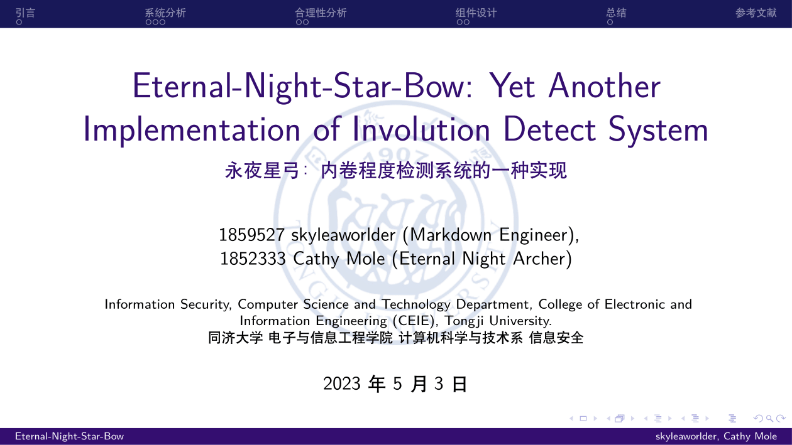

# Tongji-Beamer

:page_facing_up: 同济大学 Beamer / 幻灯片 模板。

## :one: 使用

### 1. PC 端

需满足下列前置条件：

* 确保 PC 中已下载 `TeXLive`（建议 2019 版本及以上），`TeXLive` 作为被活跃维护的 `TeX` 发行版，使用中问题较少。如未下载可访问 [TeXLive](https://tug.org/texlive)，对应 PC 操作系统选择不同下载方式；
* **不要尝试使用 CTeX！！！** 网络上可获取的 `CTeX` 版本过低，这里给出不推荐使用 `CTeX` 的几点原因：
  * 如 [CTeX 发布日志](http://www.ctex.org/CTeXReleaseNotes) 所述，该项目已于 2012.03.22 起停止开发！
  * 使用 `CTeX` 可能带来一些问题：该项目中期望使用 `ctexbeamer.cls`，但 `CTeX` 中并不存在该包；
  * `CTeX` 内置 `MiKTeX` 中的 `mpm` 版本过低，远端仓库缺乏维护，存在相当多的宏包无法下载。即使安装高版本 `mpm`，也很有可能不兼容原有 `CTeX` 中的其他套件。
* 如果 PC 曾安装过 `CTeX`，在安装 `TeXLive` 后重新设置环境变量即可。

使用 git 克隆该仓库，或在 [Release 页面](https://github.com/TJ-CSCCG/Tongji-Beamer/releases) 中获得发布版本。

```shell
> git clone https://github.com/TJ-CSCCG/Tongji-Beamer
```

#### i. 终端操作

可以通过 make 编译出样例 pdf：

```shell
> make build
```

而后，可以基于项目中的 Makefile 自定义操作。

#### ii. VSCode

使用 VSCode 编辑 / 编译该模板需要首先在 Extensions Marketplace 中下载 **LaTeX Workshop** 插件，建议增加如下配置：

```json
// latex compile phase
"latex-workshop.latex.recipes": [
    {
        "name": "latexmk",
        "tools": ["latexmk"]
    }
],
"latex-workshop.latex.tools": [
    // latexmk compile command definition
    {
        "name": "latexmk",
        "command": "latexmk",
        "args": [
            "-synctex=1",
            "-interaction=nonstopmode",
            "-file-line-error",
            "-xelatex",
            "%DOC%"
        ]
    }
]
```

### 2. Overleaf

#### 通过模板新建项目

您可以通过以下链接访问我们的 Overleaf 模板并使用：[](https://www.overleaf.com/latex/templates/tongji-beamer-template/gnbqzdkqfqbb)

#### 自行导入 Overleaf

```shell
> git clone https://github.com/TJ-CSCCG/Tongji-Beamer
```

之后登陆 Overleaf，新建项目后，将整个文件夹直接上传到项目中。

为确保编译通过，需将 Overleaf 的 Menu/Compiler 设置为 **XeLaTeX** / **LuaLaTeX**。

## :two: 贡献

当前模板在观感、实用性、编写体验等方面仍存在很大提升空间。

欢迎熟悉 `TeX` 基本指令和模板编辑的同学美化该模板。

## :three: 参考

该仓库本质是对其他大学 Beamer 的 “套壳”。在这个过程中，我从以下仓库中得到了重要的参考，感谢这些仓库的开发者们：

* [SJTUBeamer](https://github.com/sjtug/SJTUBeamer)
* [ruc-beamer-template](https://github.com/andelf/ruc-beamer-template)，[SEU-Beamer-Slide](https://github.com/TouchFishPioneer/SEU-Beamer-Slide)，[zju-beamer-theme](https://github.com/corenel/zju-beamer-theme)
* [THU-Beamer-Theme](https://github.com/tuna/THU-Beamer-Theme)，[PKU-Beamer-Theme](https://github.com/inFaaa/PKU-Beamer-Theme)
* [ustcbeamer](https://github.com/ustctug/ustcbeamer)

（注：放在一起的说明是互相套壳，写的都差不多）

## :four: 示例



## :five: 许可证

使用 **LPPL-1.3c** 许可证。

```tex
%% Copyright 2022 skyleaworlder
%
% This work may be distributed and/or modified under the
% conditions of the LaTeX Project Public License, either version 1.3
% of this license or (at your option) any later version.
% The latest version of this license is in
%   http://www.latex-project.org/lppl.txt
% and version 1.3 or later is part of all distributions of LaTeX
% version 2003/12/01 or later.
%
% This work has the LPPL maintenance status "maintained".
%
% This Current Maintainer of this work is skyleaworlder.
%
% This work consists of all the *.tex and *.sty files in
%   https://github.com/TJ-CSCCG/Tongji-Beamer
```
